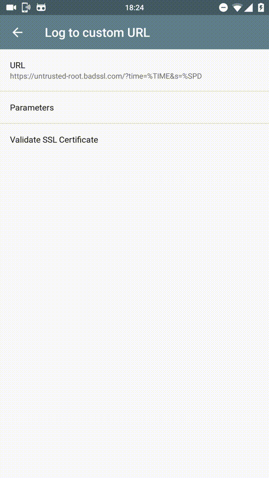

# tracker
support generic GPS tackers

Many GPS loggers/trackers allow to publish points by performing a GET
request to arbitrary HTTP server.

This "tracker" allow to store it in a plain text and retrive.

The only point is to add `&u=USER` argument, where *USER* is an arbitrary string
to put apart possibly multiple users of the service.

When invoked with only `&u=USER` argument, it will display the last point reported.

The current implementation supposes the use of [GPS Logger](https://code.mendhak.com/gpslogger/).

Graphics and geocoding by [Yandex](https://maps.ya.ru) free API.

This picture was grabbed from GPS Logger site:

